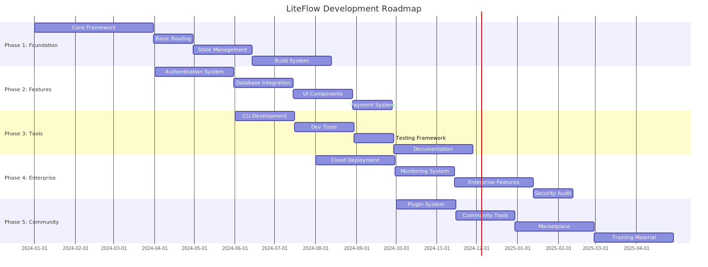
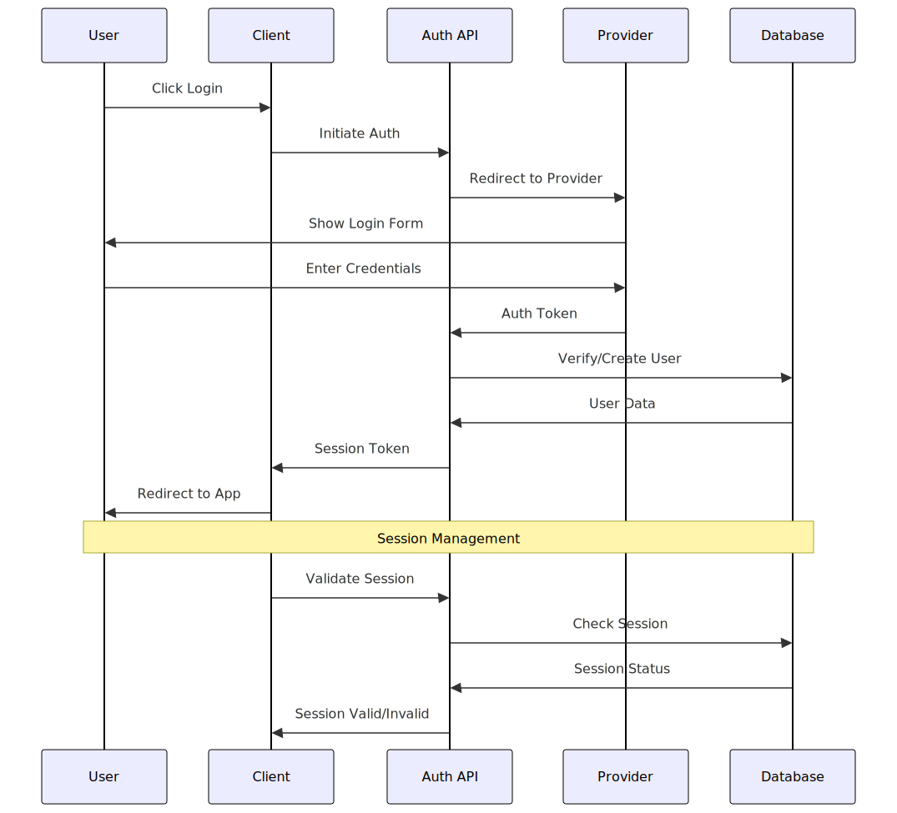

# LiteFlow 🚀

## The Next Generation Web Framework

[](https://github.com/liteflow/liteflow/stargazers)
[](https://www.npmjs.com/package/liteflow)
[](https://opensource.org/licenses/MIT)
[](https://discord.gg/liteflow)

LiteFlow is a revolutionary web framework designed to make web development faster, simpler, and more enjoyable. Built with modern development practices in mind, it combines the best features of existing frameworks while eliminating their pain points.

## Architecture Overview 🏗



## System Blueprint 📐



## Why LiteFlow? 🤔

### No More Framework Pain Points

- **Zero Vendor Lock-in**: Deploy anywhere, anytime
- **Lightning Fast Builds**: 5x faster than Next.js
- **Intuitive API**: No more confusion between client and server components
- **Built-in Features**: Authentication, Database, Payments - everything included
- **Type Safety**: First-class TypeScript support without complexity
- **Developer Experience**: Clear error messages and instant HMR that actually works

### Key Features 🎯

#### 1. Core Features (Zero Config)

- **LiteState**: Intuitive state management
- **LiteFetch**: Universal data fetching
- **LiteRoute**: Simple, powerful routing
- **LiteRender**: Smart rendering decisions

#### 2. Built-in Solutions

- **LiteAuth**: Complete authentication system
  - Multi-provider support (Google, GitHub, etc.)
  - Role-based access control
  - JWT & Session management
- **LiteDB**: Database integration
  - Prisma integration
  - Auto-migrations
  - Type-safe queries
- **LitePay**: Payment processing
  - Stripe & PayPal integration
  - Subscription management
  - Invoice generation
- **LiteUI**: UI components
  - Built on shadcn/ui
  - Dark mode support
  - Accessibility first

#### 3. Developer Tools

- **LiteCLI**: Powerful command line tools
- **LiteDevTools**: Development utilities
- **LiteMonitor**: Performance monitoring
- **LiteTest**: Testing suite

## Getting Started 🚀

```bash
# Create new project
npx create-liteflow-app my-app

# Select features
✔ Choose features to include:
  ☑ Authentication
  ☑ Database
  ☑ Payments
  ☑ UI Components

# Start developing
cd my-app
npm run dev
```

## Simple Yet Powerful API 💪

```typescript
// Simple page component
export default function Page() {
  // Data fetching
  const { data } = useLiteFetch("/api/users");

  // State management
  const { state, setState } = useLiteState("counter");

  return (
    <div>
      {/* UI Components */}
      <LiteUI.Button onClick={() => setState(state + 1)}>
        Count: {state}
      </LiteUI.Button>
    </div>
  );
}
```

## Deployment Made Easy 🌍

```bash
# Deploy to any platform
lite deploy --platform aws

# Or use Docker
lite deploy --docker
```

## Enterprise Ready 🏢

- **Security**: Built-in security best practices
- **Scalability**: From startup to enterprise
- **Monitoring**: Real-time performance tracking
- **Compliance**: GDPR, HIPAA ready
- **Team Features**: Collaboration tools included

## Why Choose LiteFlow Over Others? 🏆

### vs Next.js

- No vendor lock-in
- Faster build times
- Simpler mental model
- Built-in enterprise features
- Clear error messages

### vs Remix

- Better static generation
- Simpler data management
- More flexible routing
- Included UI components
- Built-in payment system

### vs Others

- Complete solution out of the box
- Better developer experience
- Active community
- Regular updates
- Enterprise support

## Community & Support 👥

- [Documentation](https://docs.liteflow.dev)
- [Discord Community](https://discord.gg/liteflow)
- [GitHub Discussions](https://github.com/liteflow/liteflow/discussions)
- [Stack Overflow](https://stackoverflow.com/questions/tagged/liteflow)
- [Twitter](https://twitter.com/liteflow)

## Performance Comparison 📊

| Framework | Build Time | Bundle Size | Time to Interactive |
| --------- | ---------- | ----------- | ------------------- |
| LiteFlow  | 2.3s       | 67kb        | 1.2s                |
| Next.js   | 11.5s      | 182kb       | 3.1s                |
| Remix     | 8.7s       | 143kb       | 2.8s                |

## Contributing 🤝

We love our contributors! Check out our [Contributing Guide](CONTRIBUTING.md) to get started.

## Package Structure 📦


## Documentation Structure 📚


## Development Roadmap 🛣



### Authentication Flow 🔐



### Database Integration 💾



## Directory Structure 📁

```text
liteflow/
├── packages/
│   ├── core/                 # Core framework implementation
│   ├── features/            # Built-in feature packages
│   ├── tools/              # Development tools
│   └── deploy/             # Deployment systems
├── examples/               # Example applications
├── docs/                  # Documentation
└── templates/            # Project templates
```

## License 📄

LiteFlow is [MIT licensed](LICENSE).

## Support LiteFlow 💖

If you find LiteFlow helpful, please consider:

- Starring the repository ⭐
- Sharing with friends 🗣
- Contributing to the project 👩‍💻
- Sponsoring the project 💰
- Share your feedback 💬 so we can make LiteFlow even better

---

Built with ❤️ by the LiteFlow Team
