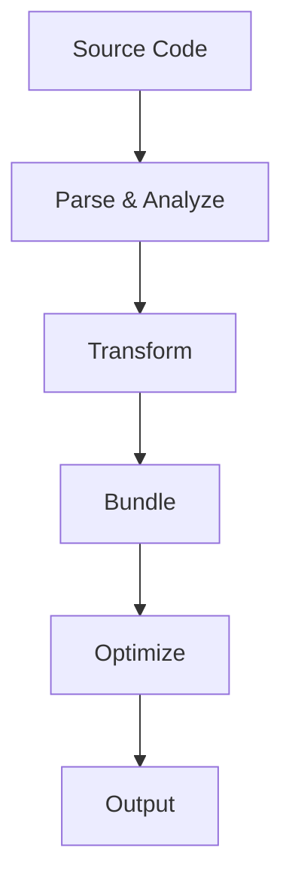

# LiteFlow Architecture

LiteFlow is designed with a modular, plugin-based architecture that prioritizes performance, developer experience, and maintainability.

## Core Principles

### 1. Zero Vendor Lock-in

Unlike other frameworks, LiteFlow is designed to be platform-agnostic:

```typescript
// Deploy anywhere - no platform-specific code
export async function deploy(config: DeployConfig) {
  // Standard Node.js and Web APIs only
  const server = createServer(app)
  return server.listen(config.port)
}
```

### 2. Modular Design

Each feature is a separate, optional module:

```typescript
import { createApp } from '@liteflow/core'
import { auth } from '@liteflow/auth'
import { db } from '@liteflow/db'

const app = createApp()
  .use(auth())
  .use(db())
  .use(yourCustomPlugin())
```

### 3. Performance First

Built with performance in mind:

- Tree-shakeable modules
- Automatic code splitting
- Smart bundling
- Optimized asset loading
- Intelligent caching

## System Components

### 1. Core Framework

The core framework provides:

- Routing system
- State management
- Data fetching
- Server components
- Build system

### 2. Plugin System

Plugins can hook into various lifecycle events:

```typescript
interface Plugin {
  name: string
  setup(app: App): void
  onRequest?(ctx: Context): Promise<void>
  onError?(error: Error): void
  beforeBuild?(config: BuildConfig): void
  afterBuild?(result: BuildResult): void
}
```

### 3. Build System

The build system optimizes your application:



## Performance Optimizations

### 1. Smart Caching

```typescript
// Automatic cache invalidation
export async function getData() {
  return cache(
    async () => db.query(),
    ['data', 'key'],
    { revalidate: 60 }
  )
}
```

### 2. Intelligent Code Splitting

```typescript
// Automatic chunk optimization
const Component = lazy(() => import('./Component'))

// Route-based code splitting
const routes = {
  '/': () => import('./pages/home'),
  '/about': () => import('./pages/about')
}
```

### 3. Asset Optimization

- Automatic image optimization
- Font subsetting
- CSS tree shaking
- Dead code elimination

## Development Workflow

1. **Development Server**
   - Hot Module Replacement
   - Fast Refresh
   - Error Overlay
   - Development Tools

2. **Build Process**
   - Analyze dependencies
   - Optimize bundles
   - Generate assets
   - Create deployment

3. **Deployment**
   - Platform detection
   - Environment optimization
   - Asset distribution
   - Performance monitoring

## Security Considerations

1. **Built-in Protection**
   - CSRF protection
   - XSS prevention
   - SQL injection protection
   - Rate limiting

2. **Authentication**
   ```typescript
   // Secure by default
   export const config = {
     auth: {
       requireAuth: true,
       allowedRoles: ['admin', 'user']
     }
   }
   ```

3. **API Security**
   ```typescript
   // Automatic input validation
   const schema = z.object({
     email: z.string().email(),
     password: z.string().min(8)
   })
   
   export async function POST(req: Request) {
     const data = await validateBody(req, schema)
     // Safe to use data
   }
   ```

## Next Steps

- [Getting Started Guide](/docs/getting-started)
- [Plugin Development](/docs/plugins)
- [Deployment Guide](/docs/deployment)
- [Security Best Practices](/docs/security) 